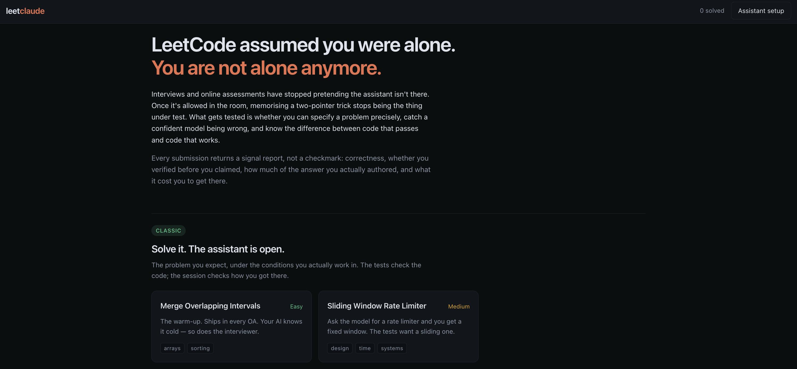

# LeetClaude

LeetCode assumed you were alone. Interviews and OAs no longer do.

Once the assistant is allowed in the room, recalling a two-pointer trick stops being the
thing under test. What's left is whether you can specify a problem precisely, catch a
confident model being wrong, and tell the difference between code that passes and code
that works. That's what this platform grades.

<p align="center">


## Modes

| Mode | The Exercise |
| --- | --- |
| **Classic** | An ordinary problem with the assistant open. The tests check the code; the session records how you got there. |
| **Bug Hunt** | You're handed clean, plausible, confidently-described AI-written code that passes every test it shipped with. Find what the hidden tests will find. |
| **Prompt Golf** | The editor is locked. You write only the prompt; a real model writes the code; the tests judge the result. Fewest characters that still passes. |

## The Signal Report

Submitting returns four axes, not a checkmark:

- **Correctness** — visible *and* hidden tests
- **Verification** — did you run the tests before you claimed it worked
- **Authorship** — how much of the solution you typed versus pasted in whole
- **Efficiency** — time taken, or prompt length in Prompt Golf

## Running It

```bash
npm install && npm run dev
```

Everything works offline except Prompt Golf and the assistant panel, which call the Anthropic API.

## How it Works

Candidate code runs in a throwaway Web Worker per run. A fresh thread is what makes the
3-second time limit enforceable, since an infinite loop can only be stopped by
terminating the thread that owns it. Problems are plain data in `src/problems/`; each
test is a source string executed against the candidate's function with a small `assert`
helper, so adding a problem means adding an object, not wiring up a runner.

**Discosure:** Entirely vibecoded as a proof of concept. The project will probably never leave localhost.
